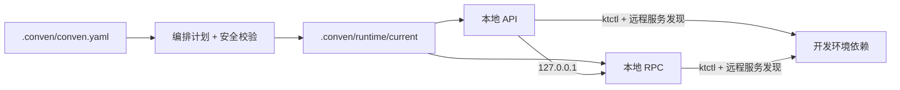

# Conven

[English](README.md) | **简体中文**

[](https://github.com/leo1394/homebrew-conven/actions/workflows/ci.yml)
[](LICENSE)

> 只在本地运行正在修改的服务，其余依赖继续通过开发集群访问。

Conven 是一个专注于本地开发的微服务编排工具。它选择一组服务在本地运行，
将选中的依赖路由到 `127.0.0.1`，未选中的依赖继续使用远程服务发现，并把生成
的配置保存在服务源码仓库之外。

- **启动最少服务：** 只运行当前改动涉及的服务。
- **保留真实拓扑：** 本地服务可以继续访问远程 RPC、数据库、Kafka、配置中心
  和其他开发环境依赖。
- **安全校验不通过即拒绝启动：** 对于支持的类型化服务，Conven 必须确认本地
  注册和监听地址已经隔离。
- **不限开发语言：** prepare、build 和 run 都是 argv 数组，并非 Go 专用钩子。

## 为什么使用 Conven

在笔记本上启动整套微服务通常很慢，也没有必要。只启动一个服务虽然更快，
但配置、服务发现、本地路由、日志和进程清理往往会变成一组项目专用脚本。

Conven 将这些约定集中到一份经过确认的 workspace manifest 中：



源码仓库仍然只用于编辑代码。运行时 YAML 副本、构建产物、日志和 session 状态
都位于 workspace 的 `.conven/runtime` 下。

## 安全设计

对于声明了 `kind: http` 或 `kind: rpc` 的服务，只有可信 Adapter 能验证最终
运行计划时，Conven 才会启动：

- 已禁用远程服务注册，或该服务类型明确不需要注册；
- 服务监听地址绑定到 loopback IP；
- run argv 指向 Conven 保护的运行时配置；
- 集群连接不会建立从集群到本机的入站路由。

任何证明缺失或含糊时，启动都会按 fail-closed 原则失败。目前可信的类型化服务
契约是 HTTP/RPC 服务使用 `go-zero + Consul + yaml-overlay`。未知的框架、服务
发现或 materializer 组合会直接拒绝，而不是假设其安全。Conven 能验证生成文件
和 argv，但无法证明任意二进制一定会遵守传入的参数。

Conven 内置的 materializer 只将生成的 YAML 写入
`.conven/runtime/current/configs/<service>`，不会覆盖仓库内的 YAML。fresh start
会先核验已保存的进程身份和运行目录，再清理 `current`。stop 和 rollback 在向
进程组发送信号前，也会验证 PID/PGID 的归属。如果无法确认清理完成，Conven
会保留 session，并阻止下一次 fresh start。

> **本地服务隔离不等于数据隔离。** 本地服务仍会使用运行时配置中的远程
> 数据库、Kafka、未选中的 RPC 客户端和后台任务，因此可能写入数据或消费消息。
> Conven 不会隔离这些副作用。

未声明 `kind` 的 runner-only 服务不具备相同的 Adapter 安全保证。项目自定义的
`prepare` 和 `build` 命令也会以当前用户权限运行，并可能修改其工作目录。

## 安装

```bash
brew tap leo1394/conven
brew install conven
```

后续升级：

```bash
brew update
brew upgrade conven
```

Conven 支持 macOS 和 Linux。只有环境使用 `ktctl` connection driver 时才需要
安装 `ktctl`；只有 Python 插件需要 Python 3。从源码构建 Conven 需要 Go 1.23
或更高版本。

## 快速上手

### 使用已有 Conven 配置的项目

如果项目已经提交 `.conven/conven.yaml`：

```bash
cd /path/to/workspace

conven doctor --dev
conven services --start --dev user-svc order-svc
```

请将示例服务名替换为 `conven services --list` 输出的名称。在交互式终端中也可以
省略服务名，通过选择器选择。启动完成后，Conven 默认打开 Dashboard。按 `q`
或 `Ctrl-C` 只会退出查看，服务会继续运行。

需要显式停止整个 workspace session：

```bash
conven services --stop-all
```

### 首次接入项目

在包含各服务仓库的目录中运行 `init`：

```bash
cd /path/to/workspace

conven init
conven services --list
conven policy --edit

conven doctor --dev
conven services --start --dev --dry-run user-svc order-svc
conven services --start --dev user-svc order-svc
```

`init` 会保守地扫描当前目录下一级的 Git 仓库。它可以识别支持的 Go main module
布局，并记录可以证明的路径、runner、服务类型和绑定候选。它**不会**猜测端口、
完整业务依赖图、公司 Policy、Apollo 凭据或集群连接信息。启动前需要人工确认
一次候选配置。

如果项目维护了 Policy 生成器，请显式安装并运行：

```bash
conven plugins --install ./generate-project-policy.py
conven plugins --run generate-project-policy --output conven-candidate.yaml
conven policy --import ./conven-candidate.yaml --edit
```

Conven 当前不内置任何项目专用插件。`policy --import` 会验证并替换完整 manifest，
并非 YAML merge。

## 一次启动如何完成

1. 查找最近的 `.conven/conven.yaml`，并解析选中的环境。
2. 选择服务，按依赖顺序生成启动分组。
3. 验证本地/远程路由、隔离契约、命令和路径。
4. 在 `.conven/runtime/current` 下生成运行时配置。
5. 复用或建立环境连接，然后执行 prepare、build、start 和 health check。
6. 记录进程身份并聚合服务日志，供后续 status、restart 和 stop 使用。

`services --start --dry-run` 在静态编排完成后结束。它不会访问 Apollo、建立连接、
生成运行时配置、构建代码、启动进程或修改 runtime 目录。

对于 manifest 中声明的依赖，是否被选中决定其路由：

```text
选中的依赖      -> manifest Policy 中声明的本地地址
未选中的依赖    -> 保留远程服务发现和配置
```

编排计划中的 **Declared remote dependencies** 只包含 manifest 明确声明的依赖，
不代表应用配置中隐藏的所有端点。对于兼容的 go-zero/Consul YAML，Conven 还会检测
启用的外部 Consul 客户端，并在服务启动前确认至少存在一个 passing 实例。

## Manifest

每个 workspace 只有一份规范 manifest：

```text
<workspace>/.conven/conven.yaml
```

它包含四个主要部分：

| 部分 | 描述 |
| --- | --- |
| `workspace` | 项目名和默认 Policy |
| `services` | 仓库路径、runner、端口、健康检查和依赖 |
| `policies` | 框架/配置 driver、运行时 overlay、路由和隔离规则 |
| `environments` | 环境变量和可选的集群连接 |

最小的 runner-only workspace 如下：

```yaml
version: 1

workspace:
  name: demo

environments:
  dev:
    connection:
      driver: none

services:
  api:
    path: services/api
    runner:
      run: [go, run, ./cmd/api]
    ports:
      http: 18080
    health:
      type: process
```

该示例有意省略 `kind`，因此只是通用 runner-only 配置。类型化 HTTP/RPC 服务必须
引用具有完整且可验证隔离契约的 Policy。包含多服务、依赖环境、健康检查和 `ktctl`
连接的配置可参考[示例 manifest](examples/application.yaml)。

命令使用 argv 数组。除非显式调用 shell，例如 `[sh, -c, "..."]`，否则管道、
重定向和 `&&` 不会被解释执行。

## 常用命令

| 操作 | 命令 |
| --- | --- |
| 列出 manifest 中的服务 | `conven services --list` |
| 刷新扫描到的服务仓库 | `conven services --registry` |
| 验证指定环境 | `conven doctor --test` |
| 预览启动计划 | `conven services --start --test --dry-run SERVICE...` |
| 启动本地服务群 | `conven services --start --test SERVICE...` |
| 重启变化或已退出的服务 | `conven services --restart` |
| 查看当前 session | `conven services --status` |
| 查看日志快照 | `conven services --logs SERVICE...` |
| 打开 Dashboard | `conven services --dashboard SERVICE...` |
| 持续输出 Plain 日志 | `conven services --logs --tail SERVICE...` |
| 停止指定服务 | `conven services --stop SERVICE...` |
| 停止整个 workspace session | `conven services --stop-all` |

使用 `--dev`、`--test` 或 `--env NAME` 选择 manifest 中声明的环境。如果启动时需要
覆盖当前机器的 Kubernetes 设置，可添加 `--namespace NAME`、`--context NAME` 或
`--kubeconfig FILE`。

fresh `--start` 会安全地重建 `runtime/current`。`--restart` 会复用该目录，只重启
发生变化或已经退出的服务；未变化的服务和共享连接会保持运行。stop 后仍会保留
当前日志和生成文件，供排查使用，直到下一次安全的 fresh start。

## 日志

Conven 提供两种用途明确的日志查看模式：

| 模式 | 适用场景 | 行为 |
| --- | --- | --- |
| Dashboard | 实时概览 | 固定 workspace banner、应用内滚动和 `/` 搜索，最多保留 10,000 行 |
| Plain | 使用终端原生搜索或导出 | 使用正常终端 scrollback、`Command+F`、管道和重定向，follow 前最多回放 10,000 行 |

```bash
# 全屏查看器；下一条命令是等价别名。
conven services --dashboard
conven services --logs --dashboard

# Plain 持续日志流。
conven services --logs --tail
```

交互式 `services --start` 默认打开 Dashboard。显式指定
`services --start --tail` 会使用 Plain 模式；非交互式启动会在服务就绪后返回，
并让服务继续运行。如果 `services --logs` 同时出现 `--dashboard` 和 `--tail`，
最后一个参数生效。

Dashboard 操作：方向键或鼠标滚轮滚动，`PgUp`/`PgDn` 翻页，`g`/`G` 跳转，
`/` 搜索，`n`/`N` 切换匹配项，`Esc` 清除搜索。按 `q` 或 `Ctrl-C` 退出查看。
Plain 模式使用 `Ctrl-C` 退出查看。这些操作都不会停止服务。

## 配置与插件

当前机器专用的 ktctl 设置应放在共享 manifest 之外：

```bash
conven config ktctl.path /opt/homebrew/bin/ktctl
conven config ktctl.kubeconfig /secure/dev-kubeconfig

# 为所有 workspace 设置默认值。
conven config --global ktctl.path ktctl
```

workspace 配置位于 `.conven/config`，全局配置位于 `~/.conven/config`，本地值覆盖
全局值。不要将 kubeconfig 文件和凭据提交到源码仓库。

使用以下命令管理本地 Python 插件：

```bash
conven plugins --install ./plugin.py
conven plugins --list
conven plugins --run plugin --output candidate.yaml
conven plugins --remove plugin
```

插件以规范 workspace 作为工作目录运行。请将插件视为可信本地代码，并在导入前
检查它生成的 Policy 候选配置。

## 运行目录

```text
<workspace>/.conven/runtime/
├── .lock
├── session.json
├── connection.log
└── current/
    ├── artifacts/
    ├── configs/
    └── logs/
```

workspace 运行目录和文件仅允许当前用户访问。Conven 会拒绝 symlink 或越界的清理
目标。唯一共享的运行状态是 `~/.conven/state/connections` 下的 connection lease
元数据；业务构建产物、运行时配置和服务日志始终保留在 workspace 中。

## 适用范围

- 服务 runner 不限语言；自动仓库分析目前仅支持已适配的 Go module 布局。
- 配置可以来自仓库 YAML 或 Apollo，并使用 `yaml-overlay` 生成运行时副本。
- `ktctl connect` 用于建立本机到集群的访问能力。Conven 不使用 `ktctl exchange`，
  不创建反向路由，也不是 service mesh 或 preview environment 工具。
- 健康检查只用于确认启动就绪；Conven 不是监控系统。
- 外部 Consul preflight 只覆盖识别到的客户端绑定，不会完整检查数据库、Kafka、
  后台任务或所有依赖的就绪状态。

## 帮助与开发

```bash
conven --help
conven help services
man conven
```

安装版本附带的手册是该版本最权威的参考。源码手册位于
[`docs/conven.1`](docs/conven.1)，发布步骤见 [`RELEASING-ZH.md`](RELEASING-ZH.md)，版本
变更见 [`CHANGELOG.md`](CHANGELOG.md)。

在项目根目录运行仓库检查：

```bash
go test ./...
go vet ./...
go build ./cmd/conven
```

Conven 使用 [MIT License](LICENSE)。
