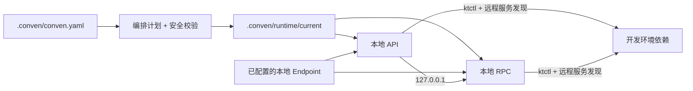

# Conven

[English](README.md) | **简体中文**

[](https://github.com/leo1394/homebrew-conven/actions/workflows/ci.yml)
[](LICENSE)


Conven 是一个专注于本地开发的微服务编排工具。它选择一组服务在本地运行，并通过
配置的 Endpoint 或开发集群访问其余依赖。生成配置始终保存在服务源码仓库之外。

- **启动最少服务：** 只运行当前改动涉及的服务。
- **保留真实拓扑：** 本地服务可以继续访问远程 RPC、数据库、Kafka、配置中心
  和其他开发环境依赖。
- **安全校验不通过即拒绝启动：** 对于支持的类型化服务，Conven 必须确认本地
  注册和监听地址已经隔离。
- **不限开发语言：** prepare、build 和 run 都是 argv 数组，并非 Go 专用钩子。

## 为什么使用 Conven

在笔记本上启动整套微服务通常很慢，也没有必要。只启动一个服务虽然更快，
但配置、服务发现、本地路由、日志和进程清理往往会变成一组项目专用脚本。

Conven 将这些约定集中到一份经过确认的 workspace manifest 中：



源码仓库仍然只用于编辑代码。运行时 YAML 副本、构建产物、日志和 session 状态
都位于 workspace 的 `.conven/runtime` 下。

## 安全设计

对于声明了 `kind: http` 或 `kind: rpc` 的服务，只有可信 Adapter 能验证最终
运行计划时，Conven 才会启动：

- 已禁用远程服务注册，或该服务类型明确不需要注册；
- 服务监听地址绑定到 loopback IP；
- run argv 指向 Conven 保护的运行时配置；
- 集群连接不会建立从集群到本机的入站路由。

任何证明缺失或含糊时，启动都会按 fail-closed 原则失败。目前可信的类型化服务
契约是 HTTP/RPC 服务使用 `go-zero + Consul + yaml-overlay`。未知的框架、服务
发现或 materializer 组合会直接拒绝，而不是假设其安全。Conven 能验证生成文件
和 argv，但无法证明任意二进制一定会遵守传入的参数。

Conven 内置的 materializer 只将生成的 YAML 写入
`.conven/runtime/current/configs/<service>`，不会覆盖仓库内的 YAML。fresh start
会先核验已保存的进程身份和运行目录，再清理 `current`。stop 和 rollback 在向
进程组发送信号前，也会验证 PID/PGID 的归属。如果无法确认清理完成，Conven
会保留 session，并阻止下一次 fresh start。

> **本地服务隔离不等于数据隔离。** 本地服务仍会使用运行时配置中的远程
> 数据库、Kafka、未选中的 RPC 客户端和后台任务，因此可能写入数据或消费消息。
> Conven 不会隔离这些副作用。

未声明 `kind` 的 runner-only 服务不具备相同的 Adapter 安全保证。项目自定义的
`prepare` 和 `build` 命令也会以当前用户权限运行，并可能修改其工作目录。

## 安装

### Homebrew（推荐）

```bash
brew install leo1394/conven/conven
```

安装完成后，升级可以直接使用短名称：

```bash
brew update
brew upgrade conven
```

### Bash

如果本机 Homebrew 版本过低，无法安装 Formula，可通过 Bash 构建并安装已发布
版本：

```bash
curl -fsSL https://raw.githubusercontent.com/leo1394/homebrew-conven/master/install.sh | bash
```

Bash 安装需要 `curl`、`tar` 和 Go 1.23 或更高版本。脚本会使用仓库发布的
SHA256 清单校验源码归档，构建 Conven，并安装到 `~/.local/bin`。如果脚本提示
该目录不在 `PATH` 中，请按提示添加；再次执行同一命令即可升级。也可以指定版本
或安装目录：

```bash
curl -fsSL https://raw.githubusercontent.com/leo1394/homebrew-conven/master/install.sh | CONVEN_VERSION=0.3.1 bash
curl -fsSL https://raw.githubusercontent.com/leo1394/homebrew-conven/master/install.sh | CONVEN_INSTALL_DIR=/absolute/bin bash
```

Conven 支持 macOS 和 Linux。只有环境使用 `ktctl` connection driver 时才需要
安装 `ktctl`；只有 Python 插件需要 Python 3。匹配 Homebrew bottle 时，客户端
不需要安装 Go；从源码构建 Conven 需要 Go 1.23 或更高版本。

## 快速上手

### 从 0 开发：没有集群和远程依赖

先创建 `local` 环境并查看当前可用的 Service：

```bash
cd /path/to/workspace

conven init --local
conven services --list
```

明确启动多个本地服务时直接列出名称；需要递归加入
本地 Service 依赖时使用显式选项 `--with-dependencies`：

```bash
conven services --start portal-api-service
conven services --start portal-api-service --with-dependencies
```

默认只启动显式选中的 Service。将本地 Service 所需的连接地址声明为环境 Endpoint，
再映射给使用它的 Service：

```yaml
environments:
  local:
    connection:
      driver: none
    endpoints:
      postgres:
        protocol: tcp
        address: 127.0.0.1:5432

services:
  portal-api-service:
    path: services/portal-api-service
    runner:
      run: [go, run, ./cmd/portal-api-service]
    dependencies:
      postgres:
        env:
          DATABASE_URL: postgres://dev:dev@${dependency.address}/app
```

Conven 会在启动 Service 前检查其引用的 Endpoint。只有一个环境时无需反复传
`--env local`：

```bash
conven doctor --env local
conven services --start portal-api-service
conven status
```

完整步骤见
[纯本地新手手册](docs/getting-started-local-zh.md)。

### 使用已有 Conven 配置的项目

如果项目已经提交 `.conven/conven.yaml`：

```bash
cd /path/to/workspace

conven doctor --test
conven services --start --test portal-api-service partner-service visit-plan-mgr-service
```

0.3 可直接读取现有 Manifest v1 workspace，无需迁移，并保持 0.2.x 的 `dev` 默认环境、
本地依赖和远程依赖行为。Manifest v2 在此基础上增加无集群环境、环境文件、显式
Endpoint 和依赖解析规则。

请将示例服务名替换为 `conven services --list` 输出的名称。在交互式终端中也可以
省略服务名，通过选择器选择。启动完成后，Conven 默认打开 Dashboard。按 `q`
或 `Ctrl-C` 只会退出查看，服务会继续运行。


需要显式停止整个 workspace session：

```bash
conven services --stop-all
```

### 首次接入项目

在包含各服务仓库的目录中运行 `init`：

```bash
cd /path/to/workspace

conven init
conven catalog --validate
conven services --list
conven policy --edit

conven doctor --dev
conven services --start --dev --dry-run portal-api-service partner-service
conven services --start --dev portal-api-service partner-service
```

`init` 会完成首次一级子仓库 registry 扫描，并初始化以下文件：

| 文件 | 用途 |
| --- | --- |
| `.conven/conven.yaml` | 定义环境、服务、Policy 和运行行为的规范 workspace manifest。 |
| `.conven/catalog.yaml` | 声明 repository/RPC binding identity、服务类型、唯一 local port 和 disabled bindings 的生成器目录。 |
| `CONVEN-WORKSPACE-POLICY-GENERATOR-AI-SPEC.md` | 用于实现 workspace Policy 生成器插件的 AI 可读规范。 |
| `README.md` | 介绍生成文件和 Conven 工作流的 workspace 本地快速上手文档。 |

每个文件仅在缺失时创建；已有的普通文件会保持不变。`init` 可以识别支持的 Go main module
布局，并记录可以证明的路径、runner、服务类型和绑定候选。它**不会**猜测端口、
完整业务依赖图、公司 Policy、Apollo 凭据或集群连接信息。启动前需要人工确认
一次候选配置。

后续执行 `services --registry` 会刷新仓库条目，但不会猜测端口或改写
`.conven/catalog.yaml`。catalog entry 可以使用 `repository`、`rpcBinding` 或同时
使用两者，因此服务不必存在本地 checkout。使用 `conven catalog --edit` 更新目录，
使用 `conven catalog --validate` 校验目录。

如果项目维护了 Policy 生成器，请安装后运行唯一的 workspace 插件，或显式指定名称。
首次运行前还需按生成的 AI 规范补全 workspace 专用的 `conven-generator.json`；`init`
不会猜测环境或连接策略：

```bash
conven plugins --install ./generate-workspace-policy.py
conven plugins --run --output
conven policy --import --edit
```

Conven 当前不内置任何项目专用插件。`policy --import` 会验证并替换完整 manifest，
并非 YAML merge。

## 一次启动如何完成

1. 查找最近的 `.conven/conven.yaml`，并解析选中的环境。
2. 选择服务，解析每条 dependency edge，并按依赖顺序生成启动分组。
3. 验证本地 Service、Endpoint、remote、disabled 路由以及隔离契约、命令和路径。
4. 检查被引用的外部 Endpoint 是否就绪。
5. 复用或建立环境连接，在 `.conven/runtime/current` 生成运行时配置。
6. 执行 prepare、build、start 和 health check，再记录状态和聚合日志。

### 配置物化顺序

第 5 步按两条相互关联的链路完成。以下 `runtime/current/application.yaml` 是单个服务
运行时配置副本的简写；实际文件位于
`.conven/runtime/current/configs/<service>/application.yaml`。Apollo 整体替换只作用于
这份受保护的运行时副本，不会覆盖仓库文件。

从仓库基线配置到远程依赖预检的完整链路：

```text
仓库 resources/application.yaml
  → Apollo application.yml 整体替换
  → Conven manifest patches
  → runtime/current/application.yaml
  → Consul preflight
```

当 Apollo `application.yml` 作为运行时基线时，patch 和安全 guard 按以下顺序应用：

```text
Apollo application.yml
  → policy patch
  → server patch
  → services.portal-api-service.config.patches
  → dependency routing patch
  → 本地隔离 guard
  → runtime/current
```

第二条链路同时表示覆盖优先级：后面的 patch 基于前一步结果继续处理；
`services.portal-api-service.config.patches` 是服务级 manifest patch 的具体示例。
本地隔离 guard 强制并校验最终监听和注册行为，Consul preflight 则检查最终运行时配置
中仍然启用的远程依赖。

### 服务运行时配置契约

> **重要：** typed service 必须接受 Adapter 声明的运行时配置参数，并实际从该路径
> 加载配置。仅接收、声明或忽略参数不符合 Conven 接入契约。参数缺失、路径无效或
> 配置解析失败时，服务必须以非零状态退出，不得回退读取源码目录中的默认配置。

Conven 不要求所有语言使用同一个硬编码参数。业务源码应保持工具无关，只识别框架或
项目自己的配置参数；Manifest/Policy 负责把 `${configDir}` 适配成对应 argv：

| 语言/框架 | 推荐运行时参数 |
| --- | --- |
| Go/go-zero | `-f <runtime-config-directory>` |
| Java/Spring Boot | `--spring.config.location=file:<runtime-config-directory>/` |
| Python | `--config <runtime-config-file>` 或 `--config-dir <runtime-config-directory>` |
| Node.js | `--config <runtime-config-file>` 或 `--config-dir <runtime-config-directory>` |
| Dart | `--config <runtime-config-file>` 或 `--config-dir <runtime-config-directory>` |
| Rust | `--config <runtime-config-file>` 或 `--config-dir <runtime-config-directory>` |

正确实现必须完成“解析参数 → 使用该路径加载配置”；解析后仍加载源码配置同样无效。
`CONVEN_CONFIG_DIR` 是 Conven 提供给 runner hook 和编排过程的运行时元数据，不应成为
业务服务源码的推荐接入 API。完整实现、错误示例和 canary 端口行为验证见
[服务运行时配置契约](docs/service-runtime-config-contract-zh.md)。

`services --start --dry-run` 在静态编排完成后结束。它不会访问 Apollo、建立连接、
生成运行时配置、构建代码、启动进程或修改 runtime 目录。

对于 manifest 中声明的依赖，是否被选中决定其路由：

```text
选中的依赖      -> manifest Policy 中声明的本地地址
未选中的依赖    -> 保留远程服务发现和配置
```

编排计划中的 **Declared remote dependencies** 只包含 manifest 明确声明的依赖，
不代表应用配置中隐藏的所有端点。对于兼容的 go-zero/Consul YAML，Conven 还会检测
启用的外部 Consul 客户端，并在服务启动前确认至少存在一个 passing 实例。

## Manifest

每个 workspace 只有一份规范 manifest：

```text
<workspace>/.conven/conven.yaml
```

它包含四个主要部分：

| 部分 | 描述 |
| --- | --- |
| `workspace` | 项目名和默认 Policy |
| `services` | 仓库路径、runner、端口、健康检查和依赖 |
| `policies` | 框架/配置 driver、运行时 overlay、路由和隔离规则 |
| `environments` | 环境变量和可选的集群连接 |

最小的 runner-only workspace 如下：

```yaml
version: 2

workspace:
  name: demo

environments:
  dev:
    connection:
      driver: none

services:
  portal-api-service:
    path: services/portal-api-service
    runner:
      run: [go, run, ./cmd/portal-api-service]
    ports:
      http: 18080
    health:
      type: process
```

该示例有意省略 `kind`，因此只是通用 runner-only 配置。类型化 HTTP/RPC 服务必须
引用具有完整且可验证隔离契约的 Policy。包含多服务、依赖环境、健康检查和 `ktctl`
连接的配置可参考[示例 manifest](examples/application.yaml)。

命令使用 argv 数组。除非显式调用 shell，例如 `[sh, -c, "..."]`，否则管道、
重定向和 `&&` 不会被解释执行。

## 常用命令

| 操作 | 命令 |
| --- | --- |
| 查看完整 workspace 状态 | `conven status` |
| 编辑生成器服务目录 | `conven catalog --edit` |
| 校验生成器服务目录 | `conven catalog --validate` |
| 列出 manifest 中的服务 | `conven services --list` |
| 刷新扫描到的服务仓库 | `conven services --registry` |
| 验证指定环境 | `conven doctor --test` |
| 预览启动计划 | `conven services --start --test --dry-run SERVICE...` |
| 启动本地服务群 | `conven services --start --test SERVICE...` |
| 重启变化或已退出的服务 | `conven services --restart` |
| 查看当前 session | `conven services --status` |
| 查看日志快照 | `conven services --logs SERVICE...` |
| 打开 Dashboard | `conven services --dashboard SERVICE...` |
| 持续输出 Plain 日志 | `conven services --logs --tail SERVICE...` |
| 停止指定服务 | `conven services --stop SERVICE...` |
| 停止整个 workspace session | `conven services --stop-all` |
| 清理构建产物和服务日志 | `conven services --cleanup` |

使用 `--dev`、`--test` 或 `--env NAME` 选择 manifest 中声明的环境。如果启动时需要
覆盖当前机器的 Kubernetes 设置，可添加 `--namespace NAME`、`--context NAME` 或
`--kubeconfig FILE`。

fresh `--start` 会安全地重建 `runtime/current`。`--restart` 会复用该目录，只重启
发生变化或已经退出的服务；未变化的服务和共享连接会保持运行。stop 后仍会保留
当前日志和生成文件，供排查使用，直到下一次安全的 fresh start。

`--start` 和 `--restart` 还会监听运行中服务的源码变化。构建成功并通过 preflight
后执行受控替换；构建失败时保留 last-known-good 进程继续运行。`--stop-all` 会同时
终止 watcher。

执行 `--stop-all` 后，可使用 `--cleanup` 删除 `runtime/current/artifacts` 和
`runtime/current/logs`。存在 session 时会拒绝清理；运行配置和共享连接日志会保留。

## 日志

Conven 提供两种用途明确的日志查看模式：

| 模式 | 适用场景 | 行为 |
| --- | --- | --- |
| Dashboard | 实时概览 | 固定 workspace banner、长日志自动换行、应用内滚动和 `/` 搜索，最多保留 10,000 条原始日志 |
| Plain | 使用终端原生搜索或导出 | 使用正常终端 scrollback、`Command+F`、管道和重定向，follow 前最多回放 10,000 行 |

Dashboard 将 workspace、local services、disabled bindings、启动时间和实时日志
集中在一个视图。

```bash
# 全屏查看器；下一条命令是等价别名。
conven services --dashboard
conven services --logs --dashboard

# Plain 持续日志流。
conven services --logs --tail
```

交互式 start 和 restart 默认打开 Dashboard；`--tail` 使用 Plain 模式。Dashboard
支持日志自动换行、滚动和 `/` 搜索。按 `q` 或 `Ctrl-C` 退出查看，不会停止服务。

## 配置与插件

当前机器专用的 ktctl 设置应放在共享 manifest 之外：

```bash
conven config ktctl.path /opt/homebrew/bin/ktctl
conven config ktctl.kubeconfig /secure/dev-kubeconfig

# 为所有 workspace 设置默认值。
conven config --global ktctl.path ktctl
```

workspace 配置位于 `.conven/config`，全局配置位于 `~/.conven/config`，本地值覆盖
全局值。不要将 kubeconfig 文件和凭据提交到源码仓库。

使用以下命令管理本地 Python 插件：

```bash
conven plugins --install ./plugin.py
conven plugins --list
conven plugins --run --output
conven policy --import
conven plugins --remove plugin

# 显式使用用户全局插件范围。
conven plugins --install --global ./plugin.py
conven plugins --list --global
conven plugins --global --run plugin --output
conven plugins --remove --global plugin
```

workspace 插件位于 `.conven/plugins`，全局插件位于 `~/.conven/plugins`，两层允许
同名。显式名称优先执行 workspace 插件，回退到全局插件前会 warning；workspace
只有一个插件时可以省略名称，存在多个时会打开单选器；workspace 没有插件时，单选器
会显示 global 候选，即使只有一个候选也需要确认。显式 global run 必须提供名称。
`--output` 不带文件名时会原样传给插件，生成器约定写入 `application.yaml`；
`policy --import` 不带文件名时会从 workspace 根目录的 `.yaml` 和 `.yml` 文件中单选。
插件以规范 workspace 作为工作目录运行。请将插件视为可信本地代码，并在导入前检查
它生成的 Policy 候选配置。默认分组列表需要处于 workspace 中；在 workspace 外请使用
`conven plugins --list --global`。

## 运行目录

```text
<workspace>/.conven/runtime/
├── .lock
├── session.json
├── connection.log
└── current/
    ├── artifacts/
    ├── configs/
    └── logs/
```

workspace 运行目录和文件仅允许当前用户访问。Conven 会拒绝 symlink 或越界的清理
目标。唯一共享的运行状态是 `~/.conven/state/connections` 下的 connection lease
元数据；业务构建产物、运行时配置和服务日志始终保留在 workspace 中。

## 适用范围

- 服务 runner 不限语言；自动仓库分析目前仅支持已适配的 Go module 布局。
- 配置可以来自仓库 YAML 或 Apollo，并使用 `yaml-overlay` 生成运行时副本。
- `ktctl connect` 用于建立本机到集群的访问能力。Conven 不使用 `ktctl exchange`，
  不创建反向路由，也不是 service mesh 或 preview environment 工具。
- 健康检查只用于确认启动就绪；Conven 不是监控系统。
- 外部 Consul preflight 只覆盖识别到的客户端绑定，不会完整检查数据库、Kafka、
  后台任务或所有依赖的就绪状态。

## 帮助与开发

```bash
conven --help
conven help services
man conven
```

安装版本附带的手册是该版本最权威的参考。源码手册位于
[`docs/conven.1`](docs/conven.1)，发布步骤见
[`RELEASING-ZH.md`](RELEASING-ZH.md)，版本变更见 [`CHANGELOG.md`](CHANGELOG.md)。

在项目根目录运行仓库检查：

```bash
bash -n install.sh
go test ./...
go vet ./...
go build ./cmd/conven
```

Conven 使用 [MIT License](LICENSE)。
