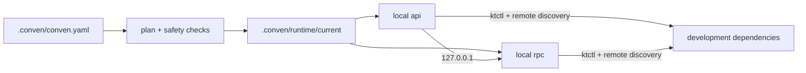

# Conven

**English** | [简体中文](README-ZH.md)

[](https://github.com/leo1394/homebrew-conven/actions/workflows/ci.yml)
[](LICENSE)

> Run the services you are changing locally. Keep the rest reachable through
> the development cluster.

Conven is a focused local microservice orchestrator. It selects a local service
group, routes selected dependencies to `127.0.0.1`, preserves remote discovery
for unselected dependencies, and keeps generated configuration outside service
repositories.

- **Start less:** run only the services involved in the current change.
- **Keep the real topology:** mix local services with remote RPC, databases,
  Kafka, configuration services, and other development dependencies.
- **Fail closed:** supported typed services do not start unless Conven can
  verify local registration and listener isolation.
- **Use any language:** prepare, build, and run steps are argv arrays, not
  Go-specific hooks.

## Why Conven

Starting an entire microservice system on a laptop is usually slow and
unnecessary. Starting one service alone is faster, but then configuration,
service discovery, local routing, logs, and process cleanup become a collection
of project-specific scripts.

Conven turns those conventions into one reviewed workspace manifest:



The source repositories remain the place you edit code. Runtime YAML copies,
artifacts, logs, and session state live under the workspace's `.conven/runtime`.

## Safety by design

For a classified service with `kind: http` or `kind: rpc`, Conven starts only
when a trusted adapter can verify the final runtime plan:

- remote service registration is disabled, or registration is explicitly not
  applicable to that server kind;
- the service listener is bound to a loopback IP;
- the run argv points to Conven's guarded runtime configuration;
- the connection creates no cluster-to-local inbound route.

If any proof is missing or ambiguous, startup fails closed. The currently
trusted typed-service contract is `go-zero + Consul + yaml-overlay` for HTTP and
RPC services. Unknown framework, discovery, or materializer combinations are
rejected instead of being assumed safe. Conven verifies generated files and
argv; it cannot prove that an arbitrary binary actually honors its flags.

Conven's built-in materializer writes generated YAML only to
`.conven/runtime/current/configs/<service>`; it does not overwrite repository
YAML. Fresh start validates saved process identity and runtime paths before
cleaning `current`. Stop and rollback also verify PID/PGID ownership before
signalling a process group. If cleanup cannot be proven complete, Conven keeps
the session and blocks the next fresh start.

> **Local isolation is not data isolation.** Local services still use the
> remote databases, Kafka brokers, unselected RPC clients, and background jobs
> present in their runtime configuration. They may write data or consume
> messages. Conven does not sandbox those effects.

Runner-only services with no `kind` do not receive the same adapter-backed
isolation guarantee. Project-defined `prepare` and `build` commands also run
with the user's normal authority and may modify their working directory.

## Install

```bash
brew install leo1394/conven/conven
```

The fully qualified command installs the tap when needed and trusts only the
`conven` Formula. After that, the short name works for upgrades:

```bash
brew update
brew upgrade conven
```

Conven supports macOS and Linux. `ktctl` is required only when the selected
environment uses the `ktctl` connection driver; Python 3 is required only for
Python plugins. A matching Homebrew bottle does not require Go on the client;
building Conven from source requires Go 1.23 or later.

## Quick start

### Use an existing Conven workspace

If the project already commits `.conven/conven.yaml`:

```bash
cd /path/to/workspace

conven doctor --dev
conven services --start --dev user-svc order-svc
```

Replace the example names with values from `conven services --list`. In an
interactive terminal you may omit the names and select services in the picker.
After startup, Conven opens the Dashboard by default. Press `q` or `Ctrl-C` to
detach; the services keep running.

Stop the workspace session explicitly:

```bash
conven services --stop-all
```

### Onboard a project

Run `init` from the directory containing the service repositories:

```bash
cd /path/to/workspace

conven init
conven services --list
conven policy --edit

conven doctor --dev
conven services --start --dev --dry-run user-svc order-svc
conven services --start --dev user-svc order-svc
```

`init` conservatively scans immediate child Git repositories. It can recognize
supported Go main-module layouts and record proven paths, runners, service
kinds, and binding candidates. It does **not** guess ports, the complete
business dependency graph, company policy, Apollo credentials, or cluster
connection details. Review the candidate once before starting services.

If the project maintains a policy generator, install and run it explicitly:

```bash
conven plugins --install ./generate-project-policy.py
conven plugins --run generate-project-policy --output conven-candidate.yaml
conven policy --import ./conven-candidate.yaml --edit
```

Conven currently bundles no project-specific plugins. `policy --import`
validates and replaces the complete manifest; it is not a YAML merge.

## How a start works

1. Resolve the nearest `.conven/conven.yaml` and selected environment.
2. Select services and build dependency-ordered start groups.
3. Validate local/remote routes, isolation contracts, commands, and paths.
4. Materialize runtime configuration under `.conven/runtime/current`.
5. Reuse or establish the environment connection, then run prepare, build,
   start, and health checks.
6. Record process identity and aggregate service logs for later status,
   restart, and stop operations.

`services --start --dry-run` stops after static planning. It does not contact
Apollo, establish a connection, materialize configuration, build code, start a
process, or modify the runtime directory.

For a declared dependency, selection determines the route:

```text
selected dependency      -> local address from the manifest policy
unselected dependency    -> remote discovery/configuration is preserved
```

The plan's **Declared remote dependencies** list covers manifest declarations,
not every endpoint hidden in application configuration. For compatible
go-zero/Consul YAML, Conven separately detects active external Consul clients
and checks for a passing instance before service startup.

## The manifest

Every workspace has one canonical manifest:

```text
<workspace>/.conven/conven.yaml
```

It has four main parts:

| Section | Describes |
| --- | --- |
| `workspace` | Project name and default policy |
| `services` | Repository paths, runners, ports, health checks, and dependencies |
| `policies` | Framework/config drivers, runtime overlays, routing, and isolation |
| `environments` | Environment variables and optional cluster connection |

A minimal runner-only workspace looks like this:

```yaml
version: 1

workspace:
  name: demo

environments:
  dev:
    connection:
      driver: none

services:
  api:
    path: services/api
    runner:
      run: [go, run, ./cmd/api]
    ports:
      http: 18080
    health:
      type: process
```

This intentionally omits `kind`, so it is a generic runner-only example. A
typed HTTP/RPC service must reference a policy with a complete, verifiable
isolation contract. See the [example manifest](examples/application.yaml) for
multiple services, dependency environments, health checks, and a `ktctl`
connection.

Commands are argv arrays. Pipes, redirects, and `&&` are not interpreted unless
you explicitly use a shell such as `[sh, -c, "..."]`.

## Daily commands

| Task | Command |
| --- | --- |
| List manifest services | `conven services --list` |
| Refresh scanned repositories | `conven services --registry` |
| Validate one environment | `conven doctor --test` |
| Preview a start | `conven services --start --test --dry-run SERVICE...` |
| Start a local group | `conven services --start --test SERVICE...` |
| Restart changed/exited services | `conven services --restart` |
| Inspect the current session | `conven services --status` |
| Show a log snapshot | `conven services --logs SERVICE...` |
| Open the Dashboard | `conven services --dashboard SERVICE...` |
| Follow plain logs | `conven services --logs --tail SERVICE...` |
| Stop selected services | `conven services --stop SERVICE...` |
| Stop the workspace session | `conven services --stop-all` |
| Remove saved artifacts and logs | `conven services --cleanup` |

Use `--dev`, `--test`, or `--env NAME` to select a declared environment. Add
`--namespace NAME`, `--context NAME`, or `--kubeconfig FILE` when a start needs
a machine-specific Kubernetes override.

Fresh `--start` safely rebuilds `runtime/current`. `--restart` reuses it and
restarts only changed or exited services; unchanged services and a shared
connection stay running. Stop preserves the current logs and generated files
for inspection until the next safe fresh start.

After `--stop-all`, `--cleanup` removes `runtime/current/artifacts` and
`runtime/current/logs`. It refuses while a session is saved and preserves
runtime configs plus the shared connection log.

## Logs

Conven offers two deliberately different viewers:

| Mode | Best for | Behavior |
| --- | --- | --- |
| Dashboard | Live overview | Fixed workspace banner, wrapped long lines, app-owned scrolling and `/` search, up to 10,000 retained logical lines |
| Plain | Terminal-native search/export | Normal scrollback, `Command+F`, pipes and redirects, up to 10,000 replayed lines before following |

```bash
# Full-screen viewer; the alias below is equivalent.
conven services --dashboard
conven services --logs --dashboard

# Plain continuous stream.
conven services --logs --tail
```

Interactive `services --start` and `services --restart` open the Dashboard by
default. Explicit `--tail` selects Plain mode; a non-interactive start or
restart returns after completing and leaves services running. Restart also
accepts an explicit `--dashboard`. If `--dashboard` and `--tail` both appear
under `services --logs` or `services --restart`, the last one wins.

Dashboard wraps long logical log lines to the terminal width without replacing
their hidden content with an ellipsis. Its arrows and mouse wheel scroll by
visual row; `PgUp`/`PgDn` page, `g`/`G` jump, `/` searches, `n`/`N` navigates
matches, and `Esc` clears search. `q` or `Ctrl-C` detaches. In Plain mode,
`Ctrl-C` detaches. Neither action stops the services.

## Configuration and plugins

Machine-specific ktctl settings belong outside the shared manifest:

```bash
conven config ktctl.path /opt/homebrew/bin/ktctl
conven config ktctl.kubeconfig /secure/dev-kubeconfig

# Apply a default for every workspace.
conven config --global ktctl.path ktctl
```

Workspace values live in `.conven/config`; global values live in
`~/.conven/config`. Local values override global values. Keep kubeconfig files
and credentials out of source control.

Manage local Python plugins with:

```bash
conven plugins --install ./plugin.py
conven plugins --list
conven plugins --run plugin --output candidate.yaml
conven plugins --remove plugin
```

Plugins run with the canonical workspace as their working directory. Treat them
as trusted local code and review generated policy candidates before import.

## Runtime layout

```text
<workspace>/.conven/runtime/
├── .lock
├── session.json
├── connection.log
└── current/
    ├── artifacts/
    ├── configs/
    └── logs/
```

Workspace runtime directories and files are user-private. Conven rejects
symlinked or out-of-bound cleanup targets. The only shared runtime state is
connection lease metadata under `~/.conven/state/connections`; business
artifacts, runtime configuration, and service logs never leave the workspace.

## Scope

- Service runners are language-agnostic; automatic repository analysis is
  currently limited to supported Go module layouts.
- Configuration can come from repository YAML or Apollo and can be materialized
  with `yaml-overlay`.
- `ktctl connect` provides local-to-cluster reachability. Conven does not use
  `ktctl exchange`, create a reverse route, provide a service mesh, or implement
  preview environments.
- Health checks establish startup readiness only; Conven is not a monitoring
  system.
- External Consul preflight covers recognized client bindings only. It is not a
  database, Kafka, background-job, or complete dependency readiness check.

## Help and development

```bash
conven --help
conven help services
man conven
```

The installed manual is the authoritative reference for that Conven version.
The source manual is available at [`docs/conven.1`](docs/conven.1). Release
steps are documented in [`RELEASING.md`](RELEASING.md), and version changes in
[`CHANGELOG.md`](CHANGELOG.md).

Run repository checks from the project root:

```bash
go test ./...
go vet ./...
go build ./cmd/conven
```

Conven is available under the [MIT License](LICENSE).
