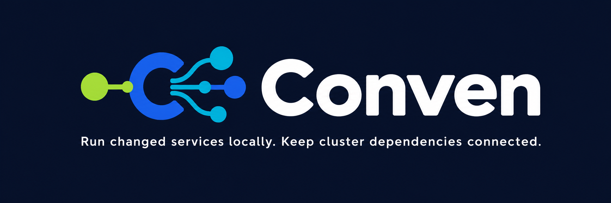
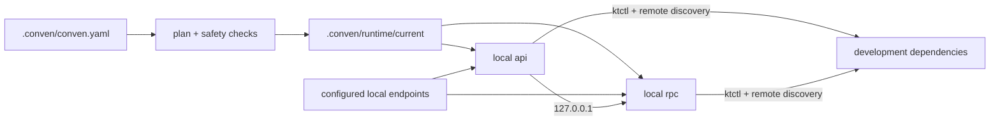
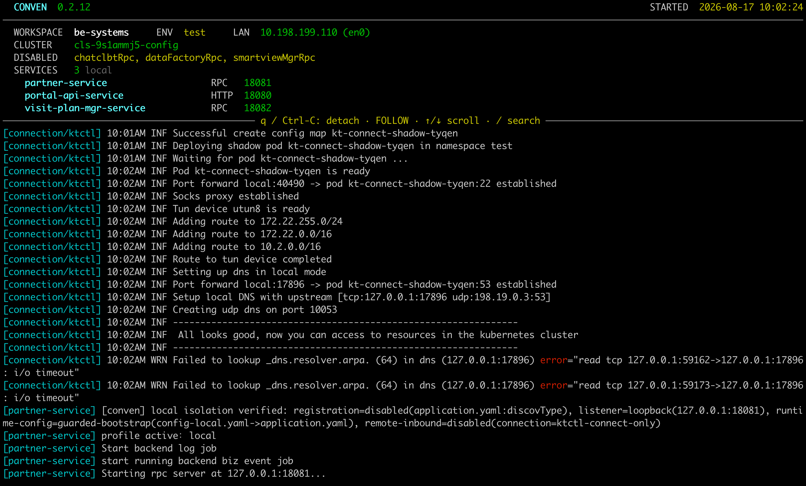

# Conven

**English** | [简体中文](README-ZH.md)

[](https://github.com/leo1394/homebrew-conven/actions/workflows/ci.yml)
[](LICENSE)



Conven is a focused local microservice orchestrator. It runs a selected service
group locally and keeps the rest reachable through configured endpoints or a
development cluster. Generated configuration stays outside service repositories.

- **Start less:** run only the services involved in the current change.
- **Keep the real topology:** mix local services with remote RPC, databases,
  Kafka, configuration services, and other development dependencies.
- **Fail closed:** supported typed services do not start unless Conven can
  verify local registration and listener isolation.
- **Use any language:** prepare, build, and run steps are argv arrays, not
  Go-specific hooks.

## Why Conven

Starting an entire microservice system on a laptop is usually slow and
unnecessary. Starting one service alone is faster, but then configuration,
service discovery, local routing, logs, and process cleanup become a collection
of project-specific scripts.

Conven turns those conventions into one reviewed workspace manifest:



The source repositories remain the place you edit code. Runtime YAML copies,
artifacts, logs, and session state live under the workspace's `.conven/runtime`.

## Safety by design

For a classified service with `kind: http` or `kind: rpc`, Conven starts only
when a trusted adapter can verify the final runtime plan:

- remote service registration is disabled, or registration is explicitly not
  applicable to that server kind;
- the service listener is bound to a loopback IP;
- the run argv points to Conven's guarded runtime configuration;
- the connection creates no cluster-to-local inbound route.

If any proof is missing or ambiguous, startup fails closed. The currently
trusted typed-service contract is `go-zero + Consul + yaml-overlay` for HTTP and
RPC services. Unknown framework, discovery, or materializer combinations are
rejected instead of being assumed safe. Conven verifies generated files and
argv; it cannot prove that an arbitrary binary actually honors its flags.

Conven's built-in materializer writes generated YAML only to
`.conven/runtime/current/configs/<service>`; it does not overwrite repository
YAML. Fresh start validates saved process identity and runtime paths before
cleaning `current`. Stop and rollback also verify PID/PGID ownership before
signalling a process group. If cleanup cannot be proven complete, Conven keeps
the session and blocks the next fresh start.

> **Local isolation is not data isolation.** Local services still use the
> remote databases, Kafka brokers, unselected RPC clients, and background jobs
> present in their runtime configuration. They may write data or consume
> messages. Conven does not sandbox those effects.

Runner-only services with no `kind` do not receive the same adapter-backed
isolation guarantee. Project-defined `prepare` and `build` commands also run
with the user's normal authority and may modify their working directory.

## Install

```bash
brew tap leo1394/conven
brew install conven
```

Add the tap once, then install the `conven` Formula. After that, the short name
works for upgrades:

```bash
brew update
brew upgrade conven
```

Conven supports macOS and Linux. `ktctl` is required only when the selected
environment uses the `ktctl` connection driver; Python 3 is required only for
Python plugins. A matching Homebrew bottle does not require Go on the client;
building Conven from source requires Go 1.23 or later.

## Quick start

### Start from zero without a cluster

Create a local environment and inspect the available services:

```bash
cd /path/to/workspace

conven init --local
conven services --list
```

Pass service names directly to start local services. Use `--with-dependencies`
to include transitive local service dependencies:

```bash
conven services --start portal-api-service
conven services --start portal-api-service --with-dependencies
```

By default, only explicitly selected services start. Declare the addresses
required by local services as environment endpoints and map them into each
consumer:

```yaml
environments:
  local:
    connection:
      driver: none
    endpoints:
      postgres:
        protocol: tcp
        address: 127.0.0.1:5432

services:
  portal-api-service:
    path: services/portal-api-service
    runner:
      run: [go, run, ./cmd/portal-api-service]
    dependencies:
      postgres:
        env:
          DATABASE_URL: postgres://dev:dev@${dependency.address}/app
```

Conven checks referenced endpoints before starting a service. A sole environment
is selected automatically:

```bash
conven doctor --env local
conven services --start portal-api-service
conven status
```

The Chinese
[local-first beginner guide](docs/getting-started-local-zh.md) contains the
complete walkthrough.

### Use an existing Conven workspace

If the project already commits `.conven/conven.yaml`:

```bash
cd /path/to/workspace

conven doctor --test
conven services --start --test portal-api-service partner-service visit-plan-mgr-service
```

Version 0.3 accepts existing Manifest v1 workspaces without migration and keeps
their 0.2.x `dev`, local dependency, and remote dependency behavior. Manifest
v2 adds no-cluster environments, environment files, explicit endpoints, and
dependency resolution rules.

Replace the example names with values from `conven services --list`. In an
interactive terminal you may omit the names and select services in the picker.
After startup, Conven opens the Dashboard by default. Press `q` or `Ctrl-C` to
detach; the services keep running.


Stop the workspace session explicitly:

```bash
conven services --stop-all
```

### Onboard a project

Run `init` from the directory containing the service repositories:

```bash
cd /path/to/workspace

conven init
conven catalog --validate
conven services --list
conven policy --edit

conven doctor --dev
conven services --start --dev --dry-run portal-api-service partner-service
conven services --start --dev portal-api-service partner-service
```

`init` performs the initial registry scan, conservatively identifying Git
repositories that are immediate children of the workspace. It initializes these
files:

| File | Purpose |
| --- | --- |
| `.conven/conven.yaml` | Canonical workspace manifest for environments, services, policies, and runtime behavior. |
| `.conven/catalog.yaml` | Declarative generator catalog for repository and RPC-binding identities, service kinds, unique local ports, and disabled bindings. |
| `CONVEN-WORKSPACE-POLICY-GENERATOR-AI-SPEC.md` | AI-readable specification for implementing the workspace policy generator plugin. |
| `README.md` | Workspace-local quick start for the generated files and Conven workflow. |

Each file is created only when missing; an existing regular file is preserved.
For supported Go main-module layouts, `init` records only verified
paths, runners, service kinds, and binding candidates. It does **not** infer
ports, a complete business dependency graph, organization-specific policy,
Apollo credentials, or cluster connection details. Review the generated
workspace manifest before starting services.

Later `services --registry` runs refresh repository entries without guessing
ports or editing `.conven/catalog.yaml`. Catalog entries may use `repository`,
`rpcBinding`, or both, so a service does not require a local checkout. Use
`conven catalog --edit` to update the catalog and `conven catalog --validate`
to check it.

If the project maintains a policy generator, install it and run the sole
workspace plugin or name it explicitly. Complete the workspace-specific
`conven-generator.json` required by the generated AI specification before the
first run; `init` does not guess environments or connection policy:

```bash
conven plugins --install ./generate-workspace-policy.py
conven plugins --run --output
conven policy --import --edit
```

Conven currently bundles no project-specific plugins. `policy --import`
validates and replaces the complete manifest; it is not a YAML merge.

## How a start works

1. Resolve the nearest `.conven/conven.yaml` and selected environment.
2. Select services, resolve every dependency edge, and build start groups.
3. Validate local-service, endpoint, remote, and disabled routes plus isolation
   and paths.
4. Check the readiness of referenced external endpoints.
5. Reuse or establish the environment connection and materialize runtime config.
6. Run prepare, build, start, and health checks, then save state and logs.

### Configuration materialization order

Step 5 follows two related pipelines. Here, `runtime/current/application.yaml`
is shorthand for a service-scoped runtime copy; the actual file lives at
`.conven/runtime/current/configs/<service>/application.yaml`. The full Apollo
replacement applies only to this guarded runtime copy and never overwrites the
repository file.

The end-to-end path from the repository baseline to remote-dependency
preflight is:

```text
repository resources/application.yaml
  → full-document replacement from Apollo application.yml
  → Conven manifest patches
  → runtime/current/application.yaml
  → Consul preflight
```

When Apollo `application.yml` supplies the runtime baseline, patches and the
safety guard are applied in this order:

```text
Apollo application.yml
  → policy patch
  → server patch
  → services.portal-api-service.config.patches
  → dependency-routing patch
  → local-isolation guard
  → runtime/current
```

The second pipeline also defines precedence: each later patch operates on the
result of the previous stage. `services.portal-api-service.config.patches` is
a concrete example of a service-scoped manifest patch. The local-isolation
guard enforces and verifies final listener and registration behavior, while
Consul preflight checks the remote dependencies that remain enabled in the
final runtime configuration.

### Service runtime configuration contract

> **Important:** A typed service must accept the runtime-configuration argument
> declared by its adapter and actually load configuration from that path.
> Merely receiving, declaring, or ignoring the argument does not satisfy the
> Conven contract. A missing path, invalid path, or parse failure must terminate
> the service with a non-zero status; the service must not fall back to a
> repository-default configuration.

Conven does not require every language to use one hard-coded flag. Application
source stays tool-agnostic and recognizes its framework-native or project-native
configuration option; the manifest or policy adapts `${configDir}` to argv:

| Language/framework | Recommended runtime option |
| --- | --- |
| Go/go-zero | `-f <runtime-config-directory>` |
| Java/Spring Boot | `--spring.config.location=file:<runtime-config-directory>/` |
| Python | `--config <runtime-config-file>` or `--config-dir <runtime-config-directory>` |
| Node.js | `--config <runtime-config-file>` or `--config-dir <runtime-config-directory>` |
| Dart | `--config <runtime-config-file>` or `--config-dir <runtime-config-directory>` |
| Rust | `--config <runtime-config-file>` or `--config-dir <runtime-config-directory>` |

A correct implementation performs both steps: parse the argument, then load
configuration from that path. Parsing it while continuing to load repository
configuration is also invalid. `CONVEN_CONFIG_DIR` is orchestration metadata for
runner hooks and the Conven process; it is not the recommended application-source
integration API. See the [service runtime configuration contract](docs/service-runtime-config-contract.md)
for complete implementations, invalid examples, and the canary-port behavioral
test.

`services --start --dry-run` stops after static planning. It does not contact
Apollo, establish a connection, materialize configuration, build code, start a
process, or modify the runtime directory.

For a declared dependency, selection determines the route:

```text
selected dependency      -> local address from the manifest policy
unselected dependency    -> remote discovery/configuration is preserved
```

The plan's **Declared remote dependencies** list covers manifest declarations,
not every endpoint hidden in application configuration. For compatible
go-zero/Consul YAML, Conven separately detects active external Consul clients
and checks for a passing instance before service startup.

## The manifest

Every workspace has one canonical manifest:

```text
<workspace>/.conven/conven.yaml
```

It has four main parts:

| Section | Describes |
| --- | --- |
| `workspace` | Project name and default policy |
| `services` | Repository paths, runners, ports, health checks, and dependencies |
| `policies` | Framework/config drivers, runtime overlays, routing, and isolation |
| `environments` | Environment variables and optional cluster connection |

A minimal runner-only workspace looks like this:

```yaml
version: 2

workspace:
  name: demo

environments:
  dev:
    connection:
      driver: none

services:
  portal-api-service:
    path: services/portal-api-service
    runner:
      run: [go, run, ./cmd/portal-api-service]
    ports:
      http: 18080
    health:
      type: process
```

This intentionally omits `kind`, so it is a generic runner-only example. A
typed HTTP/RPC service must reference a policy with a complete, verifiable
isolation contract. See the [example manifest](examples/application.yaml) for
multiple services, dependency environments, health checks, and a `ktctl`
connection.

Commands are argv arrays. Pipes, redirects, and `&&` are not interpreted unless
you explicitly use a shell such as `[sh, -c, "..."]`.

## Daily commands

| Task | Command |
| --- | --- |
| Inspect the complete workspace state | `conven status` |
| Edit the generator service catalog | `conven catalog --edit` |
| Validate the generator service catalog | `conven catalog --validate` |
| List manifest services | `conven services --list` |
| Refresh scanned repositories | `conven services --registry` |
| Validate one environment | `conven doctor --test` |
| Preview a start | `conven services --start --test --dry-run SERVICE...` |
| Start a local group | `conven services --start --test SERVICE...` |
| Restart changed/exited services | `conven services --restart` |
| Inspect the current session | `conven services --status` |
| Show a log snapshot | `conven services --logs SERVICE...` |
| Open the Dashboard | `conven services --dashboard SERVICE...` |
| Follow plain logs | `conven services --logs --tail SERVICE...` |
| Stop selected services | `conven services --stop SERVICE...` |
| Stop the workspace session | `conven services --stop-all` |
| Remove saved artifacts and logs | `conven services --cleanup` |

Use `--dev`, `--test`, or `--env NAME` to select a declared environment. Add
`--namespace NAME`, `--context NAME`, or `--kubeconfig FILE` when a start needs
a machine-specific Kubernetes override.

Fresh `--start` safely rebuilds `runtime/current`. `--restart` reuses it and
restarts only changed or exited services; unchanged services and a shared
connection stay running. Stop preserves the current logs and generated files
for inspection until the next safe fresh start.

`--start` and `--restart` also watch running services for source changes. A
successful build passes preflight before controlled replacement; a failed build
leaves the last-known-good process running. `--stop-all` stops the watcher.

After `--stop-all`, `--cleanup` removes `runtime/current/artifacts` and
`runtime/current/logs`. It refuses while a session is saved and preserves
runtime configs plus the shared connection log.

## Logs

Conven offers two deliberately different viewers:

| Mode | Best for | Behavior |
| --- | --- | --- |
| Dashboard | Live overview | Fixed workspace banner, wrapped long lines, app-owned scrolling and `/` search, up to 10,000 retained logical lines |
| Plain | Terminal-native search/export | Normal scrollback, `Command+F`, pipes and redirects, up to 10,000 replayed lines before following |

The Dashboard keeps workspace context, local services, disabled bindings, start
time, and live logs in one view.

```bash
# Full-screen viewer; the alias below is equivalent.
conven services --dashboard
conven services --logs --dashboard

# Plain continuous stream.
conven services --logs --tail
```

Interactive starts and restarts open the Dashboard by default; `--tail` selects
Plain mode. The Dashboard supports wrapped logs, scrolling, and `/` search.
Press `q` or `Ctrl-C` to detach without stopping services.

## Configuration and plugins

Machine-specific ktctl settings belong outside the shared manifest:

```bash
conven config ktctl.path /opt/homebrew/bin/ktctl
conven config ktctl.kubeconfig /secure/dev-kubeconfig

# Apply a default for every workspace.
conven config --global ktctl.path ktctl
```

Workspace values live in `.conven/config`; global values live in
`~/.conven/config`. Local values override global values. Keep kubeconfig files
and credentials out of source control.

Manage local Python plugins with:

```bash
conven plugins --install ./plugin.py
conven plugins --list
conven plugins --run --output
conven policy --import
conven plugins --remove plugin

# Use the user-global plugin scope explicitly.
conven plugins --install --global ./plugin.py
conven plugins --list --global
conven plugins --global --run plugin --output
conven plugins --remove --global plugin
```

Workspace plugins live in `.conven/plugins`; global plugins live in
`~/.conven/plugins`. The two scopes may contain the same name. An explicit run
name prefers the workspace copy and warns before falling back to global. When
the workspace has exactly one plugin, the name may be omitted; multiple
workspace plugins open the single selector. If none exists locally, the same
selector shows global candidates, including a sole candidate. An explicitly
global run requires its name. `--output`
without a filename is passed to the plugin, whose generator convention writes
`application.yaml`; `policy --import` without a filename opens the single
selector for `.yaml` and `.yml` files in the workspace root. Plugins run with
the canonical workspace as their working directory.
Treat them as trusted local code and review generated policy candidates before
import. The grouped default list requires a workspace; outside one, use
`conven plugins --list --global`.

## Runtime layout

```text
<workspace>/.conven/runtime/
├── .lock
├── session.json
├── connection.log
└── current/
    ├── artifacts/
    ├── configs/
    └── logs/
```

Workspace runtime directories and files are user-private. Conven rejects
symlinked or out-of-bound cleanup targets. The only shared runtime state is
connection lease metadata under `~/.conven/state/connections`; business
artifacts, runtime configuration, and service logs never leave the workspace.

## Scope

- Service runners are language-agnostic; automatic repository analysis is
  currently limited to supported Go module layouts.
- Configuration can come from repository YAML or Apollo and can be materialized
  with `yaml-overlay`.
- `ktctl connect` provides local-to-cluster reachability. Conven does not use
  `ktctl exchange`, create a reverse route, provide a service mesh, or implement
  preview environments.
- Health checks establish startup readiness only; Conven is not a monitoring
  system.
- External Consul preflight covers recognized client bindings only. It is not a
  database, Kafka, background-job, or complete dependency readiness check.

## Help and development

```bash
conven --help
conven help services
man conven
```

The installed manual is the authoritative reference for that Conven version.
The source manual is available at [`docs/conven.1`](docs/conven.1). Release
steps are documented in [`RELEASING.md`](RELEASING.md), and version changes are
in [`CHANGELOG.md`](CHANGELOG.md).

Run repository checks from the project root:

```bash
go test ./...
go vet ./...
go build ./cmd/conven
```

Conven is available under the [MIT License](LICENSE).
